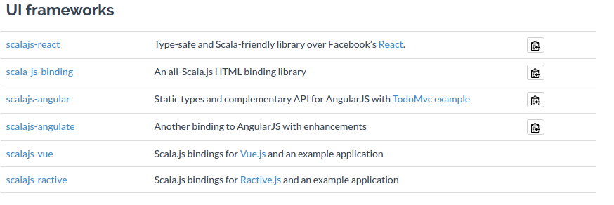
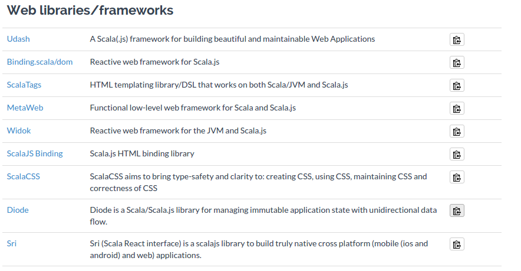
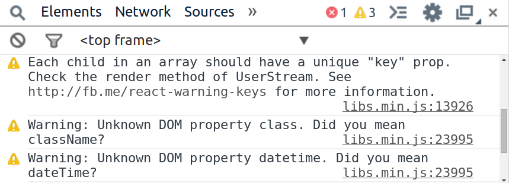

# Frontend Framework mit Scala.Js

### Eine Tour durch die möglichkeiten
   
#HSLIDE


## Grundstein des Ganzen ist Scala.js

#VSLIDE

Im Kern ist Scala.js ein Scala zu JavaScript Compiler.

Er Compiliert `.scala` Dateien in einzeln optimierte und minimierte `.js` Dateien pro Anwendung

#VSLIDE

Was dem Entwickler die möglichkeit gibt die mächtigen Sprachfunktionen von Scala zu nutzen. 

#VSLIDE

Bei Scala JS gibt es die möglichkeit ein Scala oder ein Javascript Framework zu verwenden

#VSLIDE

Ein Compiler wäre aber nichts ohne ein EcoSystem aus Biblioteken und Werkzeugen
Zum Glück deckt Scala.js auch das ab!

#VSLIDE
 
Da es hier um die erstellung einer Benutzer Oberfläche geht, nur die Relevanten ausschnitte der JS und Scala Bibliotheken aus den Scala.js Docs

 ## JavaScript Libaries
 

 
#VSLIDE

## Scala Libaries
 
 

#VSLIDE

AngularJS wurde durch Vorgaben aus der Auswahl entfernt 


#HSLIDE

Die Entscheidung fiel auf die, 2013 von Facebook ins Leben gerufene <i>Javascript-Bibliothek</i>

#HSLIDE

# React(.JS)


#VSLIDE

## Warum React ?

-  Nahe an Bekannter Syntax
-  Leichte Handhabung
-  Re-Render bei jeder Änderung 
-  Htmlcontent wird als Komponenten erzeugt 
-  Templates sind Debugfähig
-  Geschwindigkeit durch Virutellen DOM
-  Server Seitiges Rendering
-  Gute Fehlermeldungen


#VSLIDE

Desweiteren :
 


#HSLIDE

Ein näherer Blick auf möglichkeiten die React bietet:

#VSLIDE

# JSX

(Eine JavaScript Syntax erweiterung welche wie XML aussieht)

Vereinfacht die erstellung der 'Komponenten'

bsp:

#VSLIDE

### Vanilla JS

```
render: function() {
    React.DOM.div({ className: 'my-thing' },
        React.DOM.a({ href: '/path' },
            'Link: ' + this.props.linkText
        )
    );
}
```

### JSX

```
render: function() {
    return (
        <div className="my-thing">
            <a href="/path">
                Link: {this.props.linkText}
            </a>
        </div>
    );
}
```

#HSLIDE

# Virtueller DOM

+ Niemals eine echtes *_DOM_*-Element erstellen
+ React übernimmt das  


#VSLIDE

## "VDOM"-abgleich

Unterscheidet virtuelle Nodes
(vergleicht JS Objekte)


#VSLIDE

## "VDOM"-abgleich

Transparent für den Entwickler - "Hier ist ein neuer Zustand , rendere ihn"

#HSLIDE

- ## Server-   <!-- .element: class="fragment" -->
- ## seitiges  <!-- .element: class="fragment" -->
- ## Rendering <!-- .element: class="fragment" -->

#VSLIDE

### Es ist alles Virtuell!

```
var EventList = require('path/to/event-list-component');
var SomeApi = require('path/to/some-api');
var Server = require('someHttpServer').listen(80);

Server.on('request', function(req, res) {

    SomeApi.getEvents(req.params.matchId)
        .then(function(err, events) {
            var html = React.renderComponentToString(
                new EventList({ events: events })
            );
    
            res.send(html);
        });
});
```

#HSLIDE

### Es ist alles Virtuell!

Die Client Seite kann nun den tree ändern
und damit fortfahren den Status bei Änderungen zu 
Aktualisierung

#HSLIDE

### Gute Fehlermeldungen



#HSLIDE

### Automatisch gebundene Funktionen

```
React.createClass({
    onClick: function(e) {
        // "this" bezieht sich auf die Komponente
        this.setState({ clicked: true });
    },

    render: function() {
        return <button onClick={this.onClick} />;
    }
});
```

#HSLIDE

Man **benötigt** nur **eine** Methode :

## render()

#HSLIDE

## Props

Das "externe Interface" zu den Komponenten.

**propTypes** erlauben die Validierung des Input


#HSLIDE

## State

Interner Komponenten Zustand

### setState()

Führt zu einem Re-Renderen der Komponenten


#HSLIDE

Danke für Ihre Aufmerksamkeit!
